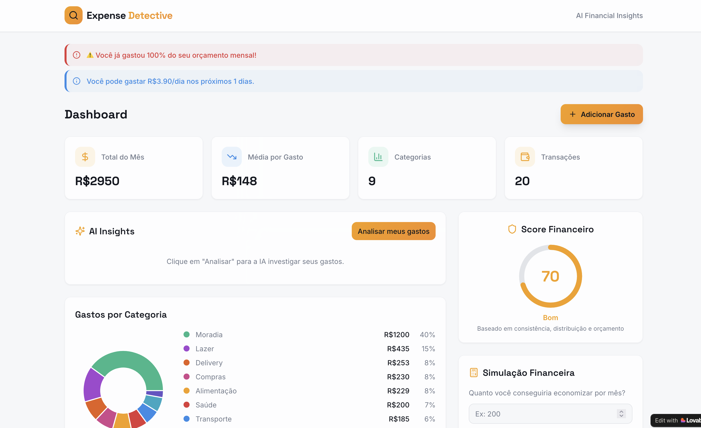
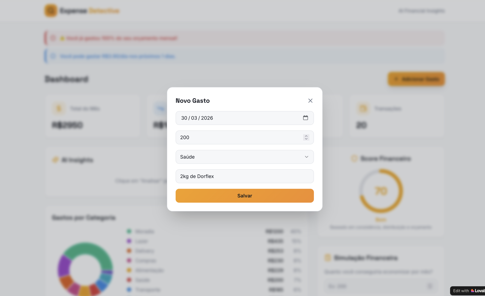
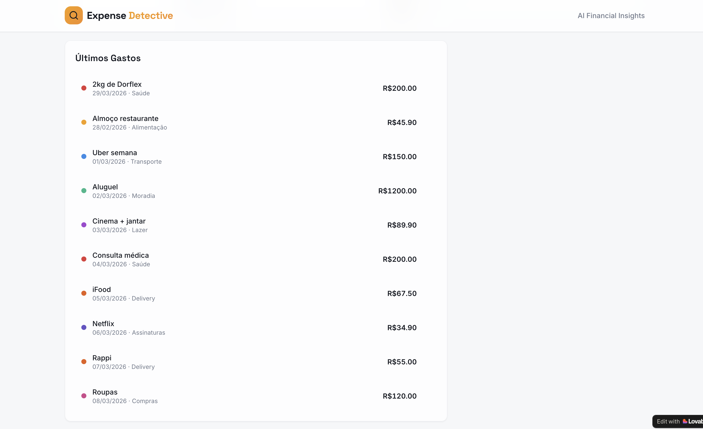
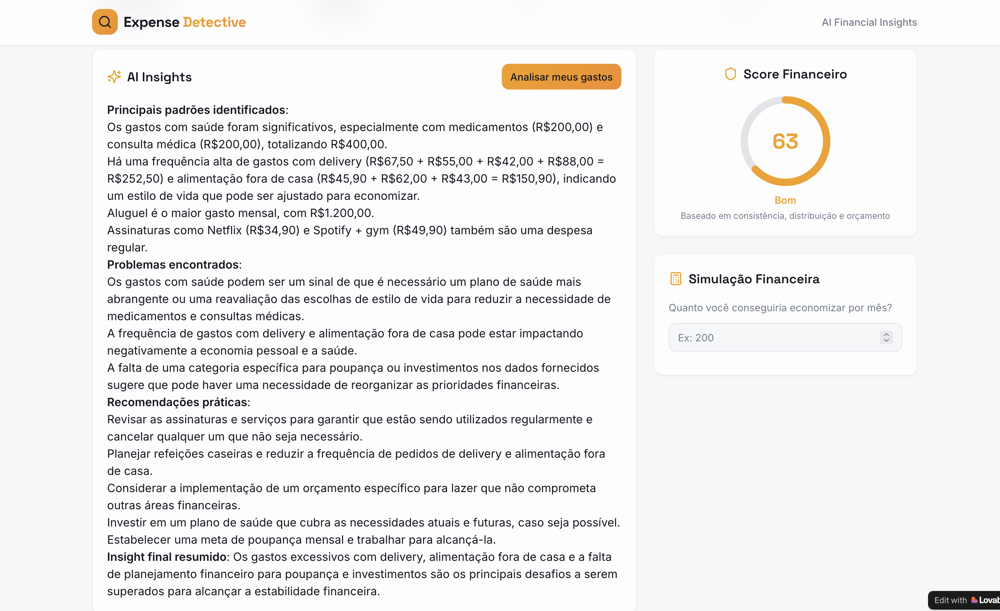

# 💸 Expense Detective AI

## 🧠 Sobre o Projeto

O Expense Detective AI é um aplicativo de finanças pessoais que utiliza inteligência artificial para analisar padrões de gastos e gerar insights acionáveis.

Diferente de aplicativos tradicionais, que apenas registram despesas e exibem gráficos, este projeto foca em **interpretar o comportamento financeiro do usuário**, explicando de forma clara e prática onde estão os problemas e como melhorar.

A proposta é transformar dados financeiros em decisões mais conscientes.

---

## 🎯 Objetivo

Ajudar usuários a:

* Entender para onde o dinheiro está indo
* Identificar hábitos financeiros prejudiciais
* Receber sugestões práticas baseadas em seus próprios dados

---

## 🚨 Problema

Ferramentas de controle financeiro geralmente:

* Mostram dados, mas não explicam
* Exigem interpretação manual
* Não ajudam na tomada de decisão

---

## 💡 Solução

O Expense Detective AI atua como um **analista financeiro pessoal**, oferecendo:

* Análise automática de padrões de gastos
* Identificação de problemas financeiros
* Recomendações práticas e personalizadas
* Simulações de economia
* Alertas inteligentes

---

## ⚙️ Funcionalidades

* 📊 Dashboard com visão geral dos gastos
* ➕ Registro manual de despesas
* 🤖 Análise financeira com IA (via Groq)
* ⚠️ Alertas automáticos
* 🔮 Simulação de economia
* 🏆 Score financeiro

---

## 🧱 Tecnologias Utilizadas

* JavaScript
* React + Vite
* Lovable (Vibe Coding)
* GitHub

---

## ▶️ Como Rodar o Projeto

Acesse online:

👉 https://expense-detective-ai-60.lovable.app/

Ou rode localmente:

```bash
npm install
npm run dev
```

Depois, acesse:

```
http://localhost:3000
```

---

## 🖼️ Demonstração

### 📊 Fluxo do Aplicativo

**1. Dashboard geral de gastos**  


**2. Cadastro de despesas**  


**3. Processamento da análise com IA**  


**4. Insights financeiros gerados**  


---


## 🤖 Uso de Inteligência Artificial

A aplicação utiliza a API da Groq para gerar análises financeiras em linguagem natural com base nos dados do usuário.

A IA é responsável por:

* Identificar padrões de consumo
* Detectar problemas financeiros
* Sugerir melhorias práticas
* Simular impactos financeiros

---

## 🧪 Prompts Utilizados

### 📌 Prompt 1 — PRD (Criação do Projeto)

```txt
📌 Product Requirements Document (PRD)

🧾 Product Name
Expense Detective AI

🎯 Objective
Criar um aplicativo de organização financeira que utiliza inteligência artificial para analisar padrões de gastos e fornecer insights claros, acionáveis e personalizados ao usuário.

👤 Target User
Pessoas que:
- Não conseguem entender para onde o dinheiro vai
- Querem melhorar hábitos financeiros
- Não gostam de planilhas complexas

🚨 Problem Statement
Usuários conseguem registrar gastos, mas têm dificuldade em interpretar seus dados financeiros e transformar isso em decisões práticas.

💡 Solution
Um app que:
- Centraliza gastos
- Analisa padrões automaticamente
- Explica comportamentos financeiros em linguagem simples
- Sugere melhorias práticas

🔑 Core Features
1. Input de Gastos
2. Dashboard
3. AI Insights
4. Alertas Inteligentes
5. Simulação Financeira
6. Score Financeiro

🎨 UI/UX Guidelines
- Interface simples
- Linguagem amigável
- Foco em insights

⚙️ Technical Requirements
- React ou Next.js
- Dados mockados
- Integração com IA

📈 Success Criteria
- Insights claros
- Facilidade de uso
```

---

### 🤖 Prompt 2 — Integração com IA (Groq)

```txt
Atualize o projeto para integrar uma API real de inteligência artificial utilizando a API da Groq.

Objetivo:
Substituir lógica simulada por análise real com IA.

Requisitos:
- Criar /src/services/aiService.js
- Usar VITE_GROQ_API_KEY
- Endpoint:
  https://api.groq.com/openai/v1/chat/completions

Função principal:
analyzeExpenses(expenses)

Prompt utilizado:

Você é um analista financeiro pessoal.

Analise os dados de gastos abaixo e gere insights claros, diretos e úteis.

Dados:
{{expenses}}

Regras:
- Linguagem simples
- Seja direto
- Identifique padrões
- Sugira melhorias

Formato:
1. Padrões
2. Problemas
3. Recomendações
4. Insight final

Modelo:
llama3-70b-8192

Integração:
- Botão "Analisar meus gastos"
- Exibir loading
- Mostrar resposta

Tratamento de erro:
"Erro ao analisar seus dados. Tente novamente."

Segurança:
- Usar .env
- Não expor API key
```

---

## 🧠 Estrutura do Projeto

```
/src
  /components
  /pages
  /services
```

---

## 💭 Aprendizados

* Como estruturar um PRD claro
* Como guiar IA com prompts bem definidos
* Como transformar dados em insights
* Diferença entre funcionalidade e valor

---

## 🚀 Possíveis Melhorias

* Integração com bancos
* Importação automática de dados
* IA com memória do usuário
* Versão mobile

---

## 📄 Licença

Projeto desenvolvido para fins educacionais (DIO).
